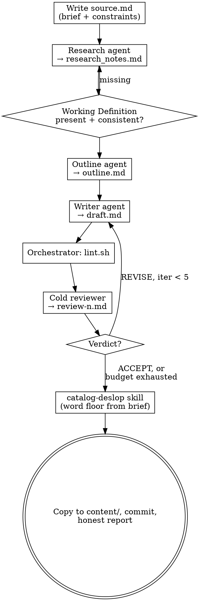

# Article Factory

Topic in, reviewed article out. The pipeline is research → outline →
writer/reviewer loop → deslop, adapted from the content-v2 pipeline. Every
stage's output is judged by an agent that did not produce it.

## Your Role

You are the **orchestrator**. You do exactly three things:

1. **Manage the pipeline state** — working dir, iteration counter, the log.
2. **Run the mechanical checks** — the lint script between writer and reviewer.
3. **Dispatch subagents** — researcher, outliner, writer, cold reviewer.

You do NOT research, outline, write, or review prose yourself. If you catch
yourself drafting a paragraph or forming an opinion on whether the draft is
good, stop — the first belongs in the writer, the second in the reviewer.

## The Iron Law

```
THE WRITER NEVER JUDGES THE DRAFT. A COLD REVIEWER'S ACCEPT IS THE ONLY EXIT.
```

No iteration ends because the draft "reads well now". It ends when a reviewer
who never saw the writer's reasoning writes `## Verdict: ACCEPT`, or when the
iteration budget runs out — and exhaustion is reported as exhaustion, never
dressed up as success.

## Inputs

| Input | Required | Notes |
|-------|----------|-------|
| Topic prompt | yes | One or a few sentences; becomes the brief |
| Project | no | Lifeos project handle, for where the final artifact lands |
| Word target | no | Default 2000–3500 words; the floor feeds the deslop gate |
| Existing brief | no | A user-written `source.md` replaces the generated brief verbatim |

## Working Files

All pipeline artifacts live in `/tmp/article-<slug>-<timestamp>/`:

```
source.md          # the brief: thesis + constraints (authoritative)
research_notes.md  # sourced evidence + working definition
outline.md         # narrative architecture
draft.md           # the article, rewritten in place each iteration
review-<n>.md      # one per reviewer pass
log.md             # append-only editorial log
```

Only the finished article and the editorial log are copied into the repo at
the end (`content/<project>/briefs/`). Pass **paths, not contents** to every
subagent — never paste the draft, notes, or reviews into a prompt.

## The Process



### Step 0 — Brief

Write `source.md` yourself (this is state management, not prose): the topic as
a one-paragraph thesis, then `## Constraints`:

- Word target (default 2000–3500; record the floor).
- First-person practitioner voice: what was tried and what failed, not analysis
  from above.
- The argument should feel discovered, not presented.
- No product-page tone. The piece must work for a reader who never uses the tool.
- Do not end with a call to action. End with the strongest idea.
- No em dashes, no semicolons, and nothing the lint patterns flag
  (`../catalog-deslop/references/lint.sh`).

If the user supplied a brief, use it verbatim and only fill in missing
constraints.

### Step 1 — Research

One agent, web access allowed:

```
You are a research agent for a long-form article.
Brief: <source.md path>. Write your notes to <research_notes.md path>.

Source priority is strict: first-person accounts first — engineering blog
posts, conference talks, postmortems, forum threads by people who did the
thing. Secondary analysis (news, listicles, other people's summaries) is
supporting material, never the backbone.

Every claim in your notes gets a "Sources:" line with the URL. A claim you
cannot source does not go in the notes.

End the notes with "## Working Definition": 2–3 sentences pinning down what
the article's central term means here. Then re-read your own notes and flag
every piece of evidence that only supports the claim if the term means
something else. Those items must be cut or the definition must be broadened
explicitly — pick one and do it before you finish.
```

Gate before proceeding: `research_notes.md` exists, has Sources lines, and has
a Working Definition section. Missing definition → redispatch, don't patch it
yourself.

### Step 2 — Outline

One agent:

```
You are a narrative architecture agent.
Brief: <source.md path>. Research: <research_notes.md path>.
Write the outline to <outline.md path> with exactly these sections:

## Central Thesis — one sentence.
## Named Concept — coin one memorable name for the core idea (the Paul Graham
"Blub Paradox" move), or state "none earned" if the material doesn't support one.
## Assumption Being Dismantled — what the reader currently believes.
## Hook — anomaly-first opening per Gwern's "First, Make Me Care": one
anomalous, concrete phrase that creates a need the article resolves. If you
raise curiosity you must pay it off; note where in the outline it pays off.
## Sections — for each: the claim, the evidence from the research notes that
proves it (cite the note), and what new thing it introduces.
## Closing — extends the argument outward; never summarizes.

Use only evidence that exists in the research notes.
```

### Step 3 — Writer/reviewer loop (max 5 iterations)

**Writer** (iteration 1):

```
You are the writer. Produce the article at <draft.md path> (Write tool,
before you finish — this is mandatory).
Brief: <source.md>. Outline: <outline.md>. Research: <research_notes.md>.

Voice rules:
- High-school vocabulary. Write the way a smart person talks over coffee, not
  the way they write a conference paper.
- Uneven, human pacing. Some sentences should be five words. The next one forty.
- Specific claim in sentence one. No warm-up.
- Practitioner, not analyst: show what was tried and what failed.
- Nothing flagged by ../catalog-deslop/references/lint.sh — read the pattern
  list before writing. No em dashes, no semicolons.

When the draft is done, run a factuality pass against the research notes:
every factual claim in the draft must trace to a note. A claim with no
support is FABRICATED — cut it. A claim stretched beyond what its source says
is DISTORTED — weaken it to exactly what the source supports. Do this before
you finish; do not report claims as checked without tracing them.
```

**Writer** (iteration ≥2): same prompt, plus the paths to the latest
`review-<n>.md` and the lint output file, and: "Address every issue in the
review. The lint output is pasted below verbatim — fix every flagged line."
(The lint output is the one exception to paths-only: paste it, it is short and
the writer must see the exact lines.)

**Between writer and reviewer**, run
`bash ../catalog-deslop/references/lint.sh <draft.md>` and save the output.

**Cold reviewer** — never sees the writer's reasoning or prior reviews:

```
You are the cold editorial reviewer, iteration <n> of 5.
Brief: <source.md>. Outline: <outline.md>. Research: <research_notes.md>.
Draft: <draft.md>. Lint output: <lint file path>.

Write <review-n.md path> in exactly this format:
## Verdict: ACCEPT|REVISE
## Issues
- [tag] line <n>: "<quote>" — <issue>   (tags: [slop] [factual] [argument] [structure] [brief])
## Summary
<3 lines max>

Rules:
- ACCEPT only when the prose reads like a human expert practitioner wrote it.
- Argument gate: for each section, does the cited evidence logically prove the
  section's claim? Correlation presented as causation without a mechanism →
  REVISE with [argument].
- Factual gate: spot-check 3 claims against the research notes.
- Brief gate: word count and constraints in source.md are binding.
- Iterations 1–2: any [slop] issue → REVISE. Iteration 3+: only 3 or more
  remaining slop issues block; isolated slop in an otherwise strong draft is
  not blocking.
- You review; you do not fix. Do not edit the draft.
```

Parse the verdict from `## Verdict:` exactly; an unparseable review counts as
REVISE and gets redispatched once. ACCEPT → step 4. Five REVISEs → proceed to
step 4 anyway, but the log and the final report must say
`Reviewer: REVISE (exhausted)` with the unresolved issues listed. Do not claim
ACCEPT.

### Step 4 — Deslop

Read `../catalog-deslop/SKILL.md` and execute it on `draft.md`, passing the
brief's word floor. Its regression gate is mandatory — the known failure of
this pipeline's ancestor was exactly here: the final pass shaved drafts under
the brief and reintroduced lint violations with no re-check. The gate exists
because that happened.

### Step 5 — Ship

1. Copy `draft.md` to `content/<project>/briefs/<slug>.md` (or where the user
   asked). Append a final entry to `log.md` — per-iteration verdicts, word
   count vs brief, deslop gate result, open gaps — and copy it to
   `content/<project>/briefs/article-log-<slug>.md`.
2. Commit both files.
3. Report: verdict history, final word count vs target, lint state, and
   anything unresolved. Lead with the honest overall status.

## Failure Modes

| Failure mode | Protection |
|--------------|------------|
| Writer self-certifies quality | Iron law; reviewer is a separate cold agent |
| Reviewer rubber-stamps to end the loop | Verdict contract + explicit ACCEPT bar + argument/factual gates |
| Evidence quietly redefines the topic | Working Definition gate in research |
| Fabricated or stretched claims | Writer's mandatory trace-to-notes pass + reviewer spot-check |
| Loop exhaustion dressed as success | `REVISE (exhausted)` is the required label |
| Final deslop regresses length/lint | catalog-deslop regression gate with the brief's word floor |
| Orchestrator writes "just the intro" | Role section — drafting belongs to the writer, always |

## Quick Reference

| Item | Value |
|------|-------|
| Working dir | `/tmp/article-<slug>-<timestamp>/` |
| Loop budget | 5 writer/reviewer iterations |
| Exit | `## Verdict: ACCEPT` or honest exhaustion |
| Leniency | [slop] blocks absolutely in iters 1–2; 3+ instances thereafter |
| Lint | `../catalog-deslop/references/lint.sh` (run between writer and reviewer) |
| Final stage | catalog-deslop skill, word floor from brief |
| Ships to | `content/<project>/briefs/` + committed |

## Red Flags — STOP and Reread This Skill

- You are writing or rewording article prose yourself.
- You are about to skip research because you "know the topic".
- The reviewer prompt includes prior reviews or the writer's reasoning.
- You parsed ACCEPT from anywhere other than a `## Verdict:` line.
- Iteration 5 finished with REVISE and your summary draft says "done".
- You pasted the draft or research notes into a prompt instead of the path.
- The deslop stage is being skipped because the draft "is already clean".
