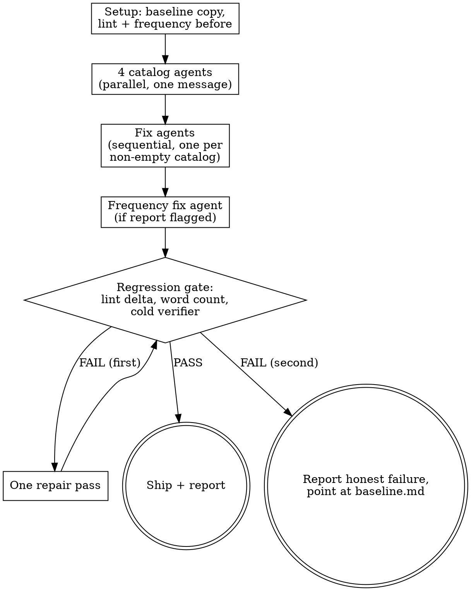

# Catalog Deslop

Take a finished draft and remove the statistical and rhetorical watermarks of
LLM prose without losing meaning, voice, or length. The core discipline: nothing
is "improved" on instinct. Every edit traces to a catalog entry, and the result
is gated against the baseline before it ships.

## Your Role

You are the **orchestrator**. You do exactly three things:

1. **Run the mechanical checks** — `references/lint.sh` and `references/frequency.py`.
   These are commands, not judgment. Running them yourself is allowed work.
2. **Dispatch subagents** — catalog agents, fix agents, one cold verifier.
3. **Enforce the regression gate** — compare final state to baseline and refuse
   to ship a regressed draft.

You do NOT edit prose yourself. Not one sentence, not "just this obvious one".
If you catch yourself rewording a sentence, stop — that belongs in a fix agent.

## The Iron Law

```
NO FIX WITHOUT A CATALOG ENTRY. NO SHIP WITHOUT THE REGRESSION GATE.
```

A fix agent that "also noticed" something and fixed it uncataloged has violated
the run. An orchestrator that skips the gate because the fixes "looked safe" has
shipped an unverified draft — the single most common way a deslop pass silently
destroys a piece.

## Inputs

| Input | Required | Notes |
|-------|----------|-------|
| Draft path | yes | Absolute path to the `.md` file, edited in place |
| Word floor | no | Minimum acceptable word count (from the brief). Default: 90% of baseline |
| Voice note | no | One or two lines on the intended voice, passed to fix agents |

## Working Files

All process artifacts live in `/tmp/deslop-<slug>-<timestamp>/`:

```
baseline.md          # untouched copy of the draft — the backup and diff base
lint-before.txt      # lint.sh output on the baseline
freq-before.md       # frequency.py output on the baseline
catalog-<category>.md
verifier.md          # cold verifier verdict
log.md               # append-only run log
```

The draft itself is edited in place at its original path. Never create `.bak`
files next to it — `baseline.md` is the backup.

Pass **paths, not contents** to every subagent. Do not paste the draft into
prompts.

## The Process



### Step 1 — Setup

```bash
d=/tmp/deslop-<slug>-$(date +%s); mkdir -p "$d"
cp <draft> "$d/baseline.md"
bash <skill-dir>/references/lint.sh <draft> > "$d/lint-before.txt"
python3 <skill-dir>/references/frequency.py <draft> > "$d/freq-before.md"
wc -w <draft>   # record in log.md
```

### Step 2 — Catalog phase (parallel)

Dispatch **four catalog agents in a single message**. Each reads the draft and
writes `/tmp/deslop-<slug>-<ts>/catalog-<category>.md`: one entry per instance
with the exact quoted text, line number, why it qualifies, and a repair
direction. An agent that finds nothing writes exactly `No instances found.`

The categories:

| Category | What to catalog |
|----------|-----------------|
| `theatrics` | Breathless urgency, dramatic reveals, suspense construction, personification of concepts ("the compiler wants", "the data tells a story") |
| `overwrought` | Pseudo-philosophical framing, academic register, inflated vocabulary. Test: would a practitioner say this over coffee, or does it sound like it's trying to win a writing award? |
| `antithesis` | Corrective contrast used as a rhetorical hammer: "It's not X, it's Y", "they didn't X, they Y", "this isn't about X" |
| `short-sentences` | Sentences under 6 words deployed as dramatic hammers. Exclude list items, headings, and sentences that are short because the thought is short |

Catalog agent prompt template:

```
You are a slop catalog agent. Category: <category>.
Draft: <absolute draft path>
Definition of the category: <row from the table above, verbatim>

Read the draft. Write every instance to <catalog path> as:
- Line <n>: "<exact quote>" — <why it qualifies> — repair: <direction, one line>

Catalog only. Do NOT edit the draft. Do NOT catalog anything outside your
category. If there are zero instances, write exactly "No instances found."
Err toward skipping borderline cases: a false catalog entry causes a bad edit.
```

### Step 3 — Fix phase (sequential)

For each catalog that is not `No instances found.`, dispatch one fix agent.
**Sequential, never parallel** — they all edit the same file.

```
You are a slop fix agent. Category: <category>.
Draft (edit in place): <absolute draft path>
Catalog: <catalog path>
Voice note: <voice note or "none">

Fix ONLY the instances listed in the catalog, using its repair directions.
Preserve the claim, the voice, and roughly the length of each passage.
Do not touch anything the catalog does not name. Do not touch code blocks or
quoted material. Do not introduce any pattern flagged by
<skill-dir>/references/lint.sh (read the pattern list if unsure — notably no
em dashes, no semicolons, no corrective antithesis).
Rewriting a flagged sentence into a different flagged sentence is a failure.
```

### Step 4 — Frequency fix (conditional)

If `freq-before.md` has flags (or a fresh run after step 3 does), dispatch one
agent:

```
You are a frequency fix agent.
Draft (edit in place): <absolute draft path>
Frequency report: <freq report path>

For each overused word: replace roughly HALF of its occurrences with varied
natural alternatives. Do not eliminate the word entirely — humans repeat words.
For each repeated n-gram: break the repetition so no more than one instance of
that exact phrasing survives, by restructuring the surrounding sentence, not by
thesaurus substitution. For monotonous sentence openers: vary them.
Preserve meaning and length. No mechanical synonym swaps — if a replacement
reads worse than the repetition, keep the repetition.
```

### Step 5 — Regression gate

Run mechanically, then dispatch one cold verifier.

1. `lint.sh` on the draft: violation count must be **lower than** `lint-before.txt`
   and ideally zero. Any violation on a line the baseline had clean = FAIL.
2. `wc -w`: below the word floor (or below 90% of baseline when no floor
   given) = FAIL. The final pass shaving a draft under its brief is a known,
   recurring failure of deslop pipelines — this check exists because it happened.
3. Cold verifier — knows nothing about the catalogs or fixes:

```
You are a cold verifier. Compare two versions of a draft:
Baseline: <baseline.md path>
Final: <draft path>

Answer only these questions, then a verdict:
1. Is any claim, fact, number, or named example from the baseline missing or
   changed in meaning in the final?
2. Did the final add hedging, qualifiers, or softening the baseline did not have?
3. Does any rewritten passage read worse than its baseline version?

Write to <verifier.md path>: a list of concrete findings (quote both versions),
then "Verdict: PASS" or "Verdict: FAIL". FAIL if question 1 has any finding.
```

Gate FAIL the first time: dispatch one repair agent with the specific failures
(verifier findings, lint lines, or word deficit), then re-run the full gate
once. Gate FAIL the second time: **stop**. Report honestly what failed, point
the user at `baseline.md`, and do not present the draft as deslopped. Restoring
the baseline is the user's call, not yours.

### Step 6 — Report

Append to `log.md` and tell the user: lint before/after counts, word count
before/after, catalog entry counts per category, verifier verdict, and anything
that failed. A run that cataloged zero instances in all four categories is a
successful run — say so plainly and change nothing.

## Failure Modes

| Failure mode | Protection |
|--------------|------------|
| Fix agent "improves" uncataloged prose | Iron law in every fix prompt; verifier catches meaning drift |
| Fixes introduce new slop patterns | Post-fix lint compared against `lint-before.txt` line by line |
| Deslop shaves the draft under its brief | Word floor check in the gate |
| Meaning quietly lost in rewrites | Cold verifier diffs baseline vs final with no fix context |
| Parallel fix agents clobber each other | Fix phase is sequential by rule |
| Orchestrator hand-edits "one obvious fix" | Role section; if it's obvious, a catalog agent will find it |
| Empty categories padded to look productive | "No instances found." is a valid, complete catalog |

## Quick Reference

| Item | Value |
|------|-------|
| Working dir | `/tmp/deslop-<slug>-<timestamp>/` |
| Backup | `baseline.md` in working dir, never `.bak` next to the draft |
| Catalog phase | 4 agents, parallel, single message |
| Fix phase | Sequential, one agent per non-empty catalog |
| Gate | lint delta + word floor + cold verifier |
| Repair budget | Exactly one repair pass, then honest failure |
| Lint | `references/lint.sh <file>` |
| Frequency | `references/frequency.py <file>` |

## Red Flags — STOP and Reread This Skill

- You are about to edit the draft yourself.
- Fix agents were dispatched in parallel.
- A fix agent's report mentions changes to text you can't find in its catalog.
- You are about to skip the gate because the diff "looks fine".
- The final word count is below the floor and you are rationalizing it.
- You pasted the draft's contents into a subagent prompt instead of the path.
- The verifier was given the catalogs or the fix agents' reasoning.
