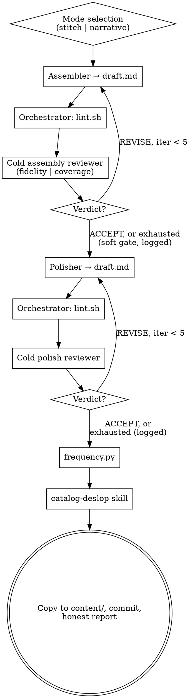

# Mosaic Writing

The user brings raw fragments — finished-ish paragraphs under beat headings.
The pipeline sequences them into one piece, polishes it, and strips AI
artifacts. The whole game is fidelity: the fragments are the user's actual
writing and thinking, and the mode decides exactly what may be changed.

## Your Role

You are the **orchestrator**. You do exactly three things:

1. **Determine the mode** and manage pipeline state (working dir, counters, log).
2. **Run the mechanical checks** — lint and frequency scripts.
3. **Dispatch subagents** — assembler, polisher, two kinds of cold reviewer.

You do NOT assemble, polish, or judge prose yourself. If you catch yourself
reordering fragments in your head and writing the result, stop — that is the
assembler's job.

## The Iron Law

```
IN STITCH MODE THE AUTHOR'S WORDING IS SACRED. IN NARRATIVE MODE THE AUTHOR'S IDEAS ARE SACRED.
```

Every dispatch states the mode and its contract. A stitch-mode agent that
"improved" a sentence has violated the run. A narrative-mode agent that dropped
an idea has violated the run. There is no mode in which both are negotiable.

## Inputs

| Input | Required | Notes |
|-------|----------|-------|
| Fragments file | yes | `# Fragments` + `## <beat>` sections of the user's raw prose |
| Brief | no | Author brief (thesis + constraints). Authoritative when present |
| Editorial direction | no | Voice model, assembly arc, cut priorities. Authoritative |
| Project | no | Lifeos project handle, for where the final artifact lands |
| Word target | no | Floor feeds the deslop gate |

## Mode Selection

Read the brief and editorial direction. Signals for **narrative mode**: they
ask for storytelling, scenes, show-don't-tell, transformation, repackaging,
first-person craft, "engaging essay". Absent those signals, default to
**stitch mode** — when in doubt, the safer contract is the one that preserves
the user's words. If the materials genuinely point both ways, ask the user one
focused question. One. Then proceed.

| | Stitch mode | Narrative mode |
|---|---|---|
| License | Sequence and connection only | Full rewrite license |
| Sacred | Exact wording of fragments | Every idea in the fragments |
| Reviewer checks | `[fidelity]` — wording preserved | `[coverage]` — every idea survives |
| Contradictions | Keep both, note the tension | May reconcile explicitly |
| Polish scope | Connective tissue only | Whole draft |

## Working Files

All process artifacts live in `/tmp/mosaic-<slug>-<timestamp>/`:

```
fragments.md            # copy of the user's fragments (never edited)
source.md, feedback.md  # copies of brief / direction, if present
draft.md                # assembled then polished, rewritten in place
review-assembly-<n>.md
review-polish-<n>.md
freq.md
log.md                  # append-only, records mode + every verdict
```

Only the finished piece and the log are copied into the repo at the end. Pass
**paths, not contents** to every subagent.

## The Process



### Stage A — Assembly loop (max 5 iterations)

**Assembler**:

```
You are the assembler, <mode> mode.
Fragments: <fragments.md path> — the author's raw writing, under beat headings.
Brief: <source.md path or "none">. Direction: <feedback.md path or "none">.
Both are authoritative where present; if the direction contains an assembly
arc, follow its order exactly.

STITCH MODE contract: your job is sequence and connection. Choose the order,
write minimal connective tissue between fragments, cut only what the
direction says to cut. Do not paraphrase, smooth over rough edges, or
"improve" the author's prose. If two fragments contradict each other, keep
both and let the tension stand.

NARRATIVE MODE contract: full rewrite license — scenes, restructuring, new
transitions. But walk the fragments when you finish: every distinct idea,
claim, and example must survive into the draft. Dropping an idea is the
failure mode, not rough prose.

You MUST write the result to <draft.md path> with the Write tool before you
finish. No em dashes, no semicolons, nothing flagged by
../catalog-deslop/references/lint.sh.
```

Iteration ≥2: same prompt plus the latest `review-assembly-<n>.md` path and
the lint output pasted verbatim, with "address every issue".

**Orchestrator**: run `../catalog-deslop/references/lint.sh` on the draft.

**Cold assembly reviewer** — never sees the assembler's reasoning or prior
reviews:

```
You are the cold assembly reviewer, <mode> mode, iteration <n> of 5.
Fragments: <path>. Brief: <path or none>. Direction: <path or none>.
Draft: <draft.md>. Lint output: <path>.

Write <review-assembly-n.md> as:
## Verdict: ACCEPT|REVISE
## Issues
- [tag] <location>: "<quote>" — <issue>
## Summary

Primary check by mode:
- Stitch: [fidelity] — walk the fragments; flag every place the draft
  paraphrased, smoothed, or dropped the author's wording without the
  direction authorizing it.
- Narrative: [coverage] — walk the fragments; flag every idea, claim, or
  example that did not survive into the draft.
Also: [slop], [structure] (does the order build an argument?), [brief].

ACCEPT means the draft reads like a skilled human wrote it in one sitting —
no catalog-style prose, no mechanical patterns. Iterations 1–2: any [slop] →
REVISE. Iteration 3+: only 3+ slop issues block. [fidelity]/[coverage]
issues always block, every iteration.
```

ACCEPT → stage B. Five REVISEs → proceed anyway (assembly is a soft gate;
polish often resolves the remaining issues) but log `Assembly: REVISE (exhausted)` and
carry the open issues into the polisher's prompt.

### Stage B — Polish loop (max 5 iterations)

**Polisher**:

```
You are the polisher, <mode> mode. Draft (edit in place): <draft.md path>.
Direction: <feedback.md path or "none"> — apply its polish notes if present.
Open issues from assembly: <list or "none">.

Do: add subheadings where the piece needs waypoints; kill enumerated
structures and feature-walkthrough tone; vary sentence rhythm (three
same-shaped sentences in a row is a defect); cut throat-clearing openings;
fix limp transitions; tighten.

STITCH MODE limit: polish only the connective tissue and structure. Never
edit inside the author's fragment prose.
NARRATIVE MODE: the whole draft is in scope, but ideas stay sacred.

No em dashes, no semicolons, nothing the lint patterns flag.
```

**Cold polish reviewer** — same verdict contract and leniency schedule as
assembly; primary check: "ACCEPT means the draft reads like a skilled human
essayist wrote it — flowing prose with natural rhythm variation, no AI
artifacts." Stitch mode: also re-verify fidelity on 3 random fragments.

Five REVISEs → continue to stage C, log `Polish: REVISE (exhausted)` with open
issues. Do not claim ACCEPT.

### Stage C — Frequency + deslop

1. `python3 ../catalog-deslop/references/frequency.py draft.md > freq.md`.
2. Read `../catalog-deslop/SKILL.md` and execute it on `draft.md` with the
   word floor. In stitch mode, add to every fix agent's prompt: "Text inside
   the author's original fragments is off-limits; fix connective tissue only."
   The regression gate is mandatory — the ancestor pipeline's polish loop ran
   to exhaustion and its final rewrite pass then shaved the draft under the
   brief's floor and reintroduced lint violations. The gate exists because
   that happened.

### Ship

Copy the final draft to `content/<project>/briefs/<slug>.md` (or where the
user asked), copy `log.md` to `content/<project>/briefs/mosaic-log-<slug>.md`,
commit both. Report: mode, verdict history for both loops, word count vs
target, deslop gate result, anything unresolved — honest status first.

## Failure Modes

| Failure mode | Protection |
|--------------|------------|
| Stitch agent "improves" the author's prose | Mode contract in every prompt; [fidelity] always blocks |
| Narrative agent drops an idea | Fragment walk required; [coverage] always blocks |
| Wrong mode guessed silently | Default to stitch; one question when genuinely ambiguous |
| Reviewer sees assembler's reasoning | Cold dispatch — draft + sources only |
| Exhausted loops reported as success | `REVISE (exhausted)` labels are mandatory in log and report |
| Deslop edits inside sacred fragments | Stitch-mode rider on every fix agent prompt |
| Final pass regresses length/lint | catalog-deslop regression gate with word floor |

## Quick Reference

| Item | Value |
|------|-------|
| Working dir | `/tmp/mosaic-<slug>-<timestamp>/` |
| Modes | stitch (wording sacred) / narrative (ideas sacred) |
| Loop budgets | 5 assembly + 5 polish iterations |
| Assembly gate | Soft — proceed on exhaustion, logged honestly |
| Polish gate | `## Verdict: ACCEPT` or honest exhaustion |
| Always-blocking tags | [fidelity] (stitch), [coverage] (narrative) |
| Final stage | frequency.py + catalog-deslop, word floor from brief |
| Ships to | `content/<project>/briefs/` + committed |

## Red Flags — STOP and Reread This Skill

- You are sequencing or rewording fragments yourself.
- A dispatch prompt does not state the mode and its contract.
- The reviewer prompt includes prior reviews or the assembler's reasoning.
- Stitch mode, and a diff shows changes inside a fragment's original text.
- You picked narrative mode because the fragments "need work", not because
  the brief asked for it.
- Exhausted loops and your report draft does not say "exhausted".
- You pasted fragments or the draft into a prompt instead of the path.
