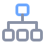

# use-coding-agents

How to use the coding agents installed on this machine (claude, codex, droid, grok, hermes, opencode, copilot, pi) as plain sub-agents in orchestrated workflows: one headless invocation, one prompt in, one result out. Deliberately ignores each CLI's own orchestration features (droid --mission, codex multi_agent, hermes delegation/moa/kanban, grok --agents, opencode personas). The orchestrator is whatever session is running the skill; the CLIs are interchangeable workers. Use when the user asks "which agent should run this", "fan out workers", "run X headless", or when a lifeos skill (overnight, timeboxed-iterating, workgraph, gauntlet, bughunt, dark-factory) needs to launch an agent CLI.

```bash
npx skills add av/skills --skill use-coding-agents
```

Part of [av/skills](https://github.com/av/skills) — a library of agent skills for Claude Code, Codex, OpenCode and other coding agents.
