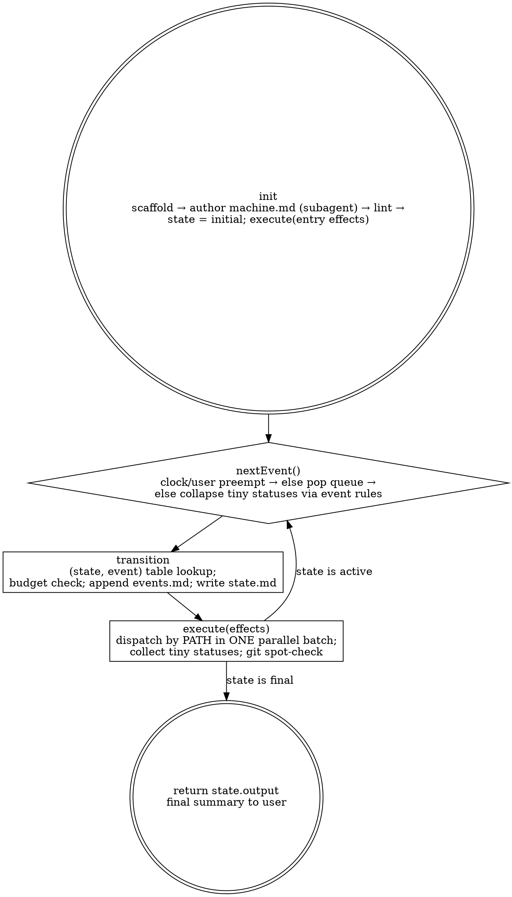

# Workmachine — An Explicit State Machine, Executed by Subagents

```
state, effects = init(machine)
execute(effects)

while state is active:
  event = nextEvent()
  state, effects = transition(machine, state, event)
  execute(effects)

return state.output
```

That is the whole orchestrator. Everything else in this skill exists to make
each of those five names concrete:

| Runtime name | What it is in a workmachine run |
|---|---|
| `machine` | `machine.md` — states, event alphabet, transition table, budgets, final states. Authored once in Phase 1. Never edited at runtime except through the ESCALATE protocol. |
| `state` | one line in `state.md` — the current state name plus its visit count; and the `output` slot once a final state is reached. |
| `init` | run the scaffold, author the machine, enter the initial state, and evaluate that state's **entry effects**. |
| `effects` | a list of side-effects a state emits on entry: subagent dispatches (by role-prompt path), `state.md`/`events.md` writes, git spot-checks. Effects **never decide anything**. |
| `execute` | dispatch the effect's subagents **in parallel**, read their TINY statuses, spot-check commits. |
| `nextEvent()` | pop ONE event token from the queue in `state.md`. Tokens come only from the alphabet; they are produced by collapsing tiny statuses with the machine's **event rules**, or by the clock / the user. |
| `transition` | a **pure table lookup**: `(state, event) → (next state, effects)`. Table miss → `ESCALATE`. Budget exhausted → the row's `on_budget` target. |
| `state.output` | the artifact pointer a final state records (commit / path / verdict). The run's return value. |

The one design commitment: **judgment happens at plan time, in the machine
file; the runtime is mechanical.** If you find yourself deciding *where to go
next* mid-run, the machine file is incomplete — stop, ESCALATE, fix the table
once, resume. Never route by feel.

## Your Role

You are the **runtime**. You do exactly five things — the five lines above:

1. **`init`** — scaffold the workspace, get the machine authored (by a subagent),
   lint it, enter the initial state, execute its entry effects.
2. **`nextEvent`** — pop one token from the event queue; if the queue is empty,
   collapse the last batch's tiny statuses into a token using the machine's
   event rules; check the clock/user first (they preempt).
3. **`transition`** — look the `(state, event)` pair up in the table. Record the
   visit and the transition in `events.md`. No lookup, no move.
4. **`execute`** — fire the target state's entry effects: dispatch subagents by
   role-prompt PATH + a short unit delta, in one parallel step; collect tiny
   statuses; `git log` spot-check any claimed commit.
5. **`return`** — when the state is final, copy `state.output` to the user as
   the final summary. Nothing else is ever written to the user mid-run.

You do **no authorship** and **no analysis** (the Orchestrator-Only Line,
inherited from timeboxed-iterating): no code edits, no queries, no reading the
codebase, no "quick fixes", no composing the machine file yourself. Even under
context pressure, even after a blowout, every productive act is a subagent.

**Pure dispatch — never ingest large content.** Subagents persist results to
their unit file, append findings to the cheatsheet, and append one line to the
digest; they return a ONE-LINE status. You read the digest tail and those
one-liners only. A return about to dump an artifact into your context is a Red
Flag — it belongs in the unit file.

## The Iron Laws

```
1. THE TABLE ROUTES. NOT YOU.         Every move is a (state, event) lookup in machine.md. A miss is ESCALATE, never an improvisation.
2. EVENTS COME FROM THE ALPHABET ONLY. A token not in the alphabet cannot be queued. Statuses are collapsed by the written event rules.
3. EFFECTS DO NOT DECIDE.             An effect dispatches, writes, or checks. It never chooses the next state.
4. EVERY CYCLE HAS A BUDGET.          A backward transition without a budget + on_budget target fails lint.
5. THE ORCHESTRATOR NEVER AUTHORS.    Not the machine, not the units, not the output. Subagents produce; you look up and dispatch.
6. INDEPENDENT EFFECTS RUN IN PARALLEL. A state whose entry effects are independent dispatches fires them in ONE batch (≤ concurrency cap).
```

## Inputs

| Input | Required | Example |
|---|---|---|
| Goal | yes | "port the importer to the new API", "produce the release notes and verify them" |
| Repo / scope | yes | `~/code/pace`; mutable vs frozen paths |
| Duration | optional | "2h", "overnight" = 8h — becomes a `deadline` event source |
| Success bar | recommended | numeric threshold OR textual rubric; drives the `pass`/`fail` event rule |
| Machine sketch | optional | the user may name the states/phases; otherwise the planner derives them |

Ask **once** for anything missing. After `init`, never ask again — a question
mid-run is a table miss: ESCALATE it.

## The Process



`done` is reachable **only** by entering a state marked `final` in
`machine.md`. There is no "feels complete" exit. A final state is entered only
via a table row like every other state.

---

## Phase 0: `init` — Scaffold

```bash
bash <skill-dir>/scaffold/init.sh \
  --slug <slug> --goal "<goal>" [--duration <e.g. 2h|90m>] [--force]
```

Creates `~/.harness/workmachine/<slug>/`:

```
machine.md       — THE MACHINE: states, alphabet, transition table, budgets,
                   final states, event rules. Seeded as a skeleton; a PLANNER
                   subagent fills it in (Phase 1). Ground truth for routing.
state.md         — THE STATE: current state + visit count, the event queue,
                   the output slot. One screen. Single source of volatile values.
events.md        — append-only log: every event popped and every transition
                   taken (`<ts> <from> --<event>--> <to>  effects: …`). Audit trail.
progress.md      — the digest: per-unit status lines appended by subagents.
                   Orchestrator reads only its tail.
cheatsheet.md    — self-populating environment knowledge (read first, append back).
run-card.md      — static orientation; NO volatile values.
prompts/         — initialiser.md, planner.md, builder.md, sub-subagent.md,
                   measurement.md — rendered ONCE; dispatched BY PATH.
units/<id>.md    — one file per unit; parallel subagents never share a write target.
```

Fill the placeholder the scaffold left in `state.md`: the **concurrency cap**.
Ensure the target repo is under git. Record `date +%s` + deadline epoch in
`state.md` if a duration was given.

## Phase 1: `init` — Author the Machine (planner subagent)

Dispatch ONE planner subagent by path: `prompts/planner.md` + the goal + any
user-supplied machine sketch. It writes `machine.md`. You do not write it.

### `machine.md` format

```markdown
# Machine: <goal>

## Alphabet
built | pass | fail | blocked | deadline | user_stop | <custom tokens…>

## Event rules            <!-- how tiny statuses collapse into ONE token -->
- all dispatched units returned `done` with commits in git log → built
- any unit returned `blocked` → blocked
- measurement returned PASS for every unit under test → pass
- any measurement returned FAIL → fail
- `date +%s` ≥ deadline → deadline   (preempts everything)
- user says stop → user_stop        (preempts everything)

## States
### PLAN          [initial]
- Entry effects: dispatch builder over units: <unit list or "derive from goal">
- Notes: <what "done" means for this state's units>
### BUILD
- Entry effects: dispatch builder(s) in parallel over: <units>
### MEASURE
- Entry effects: dispatch measurement over: <units>; bar: <numeric|textual bar>
### FIX
- Entry effects: dispatch builder over: units whose measurement FAILed
- Notes: builder reads the prior Measurement section first and writes a
  root-cause hypothesis into the unit file before editing; a repeat of the
  previous attempt returns `blocked`
### SHIP          [final]
- Output: <what to record — commit hash, path, verdict>
### ESCALATE      [final]
- Output: the (state, event) that missed / the cycle that exhausted its budget

## Transitions            <!-- (state, event) → next  [budget N → on_budget] -->
| State | Event | Next | Budget | On budget |
|---|---|---|---|---|
| PLAN | built | BUILD | — | — |
| BUILD | built | MEASURE | — | — |
| BUILD | blocked | ESCALATE | — | — |
| MEASURE | pass | SHIP | — | — |
| MEASURE | fail | FIX | 3 | ESCALATE |
| FIX | built | MEASURE | — | — |
| * | deadline | SHIP-PARTIAL or ESCALATE | — | — |
| * | user_stop | ESCALATE | — | — |
```

Rules the planner must obey (and you lint for):

- Exactly one `[initial]` state; at least one `[final]` state; `ESCALATE` always
  exists and is final.
- Every non-final state has a row for every event its effects can produce, plus
  `deadline` and `user_stop` (a `*` wildcard row is fine).
- Every backward transition (one that can revisit a state) has a **Budget** and
  an **On budget** target. The budget counts how many times **that table row**
  fires (`MEASURE/fail: 2/3`), not how many times the state is entered — a
  state reachable by two rows has two independent counters.
- Every entry effect is a dispatch, a write, or a check — never "decide".
- Every state that produces artifacts is followed by a **measurement state**
  whose effects dispatch `prompts/measurement.md`, never the producer.
- A `pass`/`fail` event rule must reference the recorded success bar
  (numeric OR textual). If the goal has no statable bar, the planner writes
  `bar: none` and MEASURE's rule collapses on ordinary scoped verification.

### Lint (you do this — it is a check, not authorship)

Read `machine.md` ONCE and verify the rules above mechanically. Any failure →
re-dispatch the planner with the lint line as its delta. Do not patch the
machine yourself. Then write `state = <initial>` and `visits = 0` into
`state.md`, append `init → <initial>` to `events.md`, and **execute the initial
state's entry effects**.

---

## Phase 2: The Loop

### `nextEvent()`

In this order — the first that yields a token wins:

1. **Preempts.** `date +%s` ≥ deadline → `deadline`. User said stop →
   `user_stop`. Queue these at the head.
2. **Queue.** If `state.md`'s event queue is non-empty, pop the head.
3. **Collapse.** Otherwise, take the tiny statuses from the last `execute` and
   apply the machine's **event rules** top to bottom; the first matching rule
   yields the token. Push it, then pop it (so it is logged as queued).

You never produce a token the alphabet does not contain. If no rule matches,
the token is `blocked` — and if `blocked` has no row either, the lookup misses
and the machine goes to ESCALATE. That is the system working, not failing.

Subagents are never given the deadline or any time awareness. Time is yours.

### `transition(machine, state, event)`

1. Find the row `(state, event)`; if none, try `(*, event)`; if none →
   `ESCALATE` with output = the missed pair.
2. If the row has a budget, increment its visit count in `state.md`; if it now
   exceeds the budget → next = the row's **On budget** target instead.
3. Append to `events.md`: `<ts>  <state> --<event>--> <next>  visits=<n>`.
4. Write the new state into `state.md`.
5. The new state's entry effects are the `effects` to execute.

No step reads an artifact. No step calls for judgment. If a step *feels* like
it needs judgment, it is a lint failure that slipped through: ESCALATE, fix the
table once via the planner, and resume.

### `execute(effects)`

Write each unit's scope into `units/<unit-id>.md` (a subagent does this if
non-trivial — you may write the one-line scope header). Then dispatch **all
independent effects in ONE message** (multiple subagent calls), each a SHORT
message:

- the role-prompt PATH — `prompts/builder.md` or `prompts/measurement.md`
  (which tells the subagent to read `prompts/initialiser.md` first);
- the unit id + unit-file path + one line naming the gap/target.

Never paste a template, the digest, the cheatsheet, or `machine.md`. Respect
the concurrency cap: 20 units with a cap of 6 → three sequential sub-batches
inside the same state; the state does not transition until all have returned.

Size a model per unit — small for mechanical, mid for standard, your own tier
for hard — **never above your own tier**.

When statuses return: `git log` spot-check each claimed commit. A claimed commit
not in git is treated as `blocked` for that unit, not `done`. Same for
measurement: a `PASS` whose unit file holds no runnable evidence (the command
run + its output, or the rubric applied line by line) is `blocked`, not `pass`.
Subagents lie; a report is a claim, not evidence.

**Unit file before dispatch.** The one-line gap in the dispatch is not the
context — the unit file is. Before dispatching, `units/<id>.md` must hold the
scope (files/topics), the constraints (user's technology choices, frozen paths,
things already rejected), and, for a FIX visit, a pointer to the prior
Measurement section. A builder dispatched against a bare unit file rediscovers
all of that and drifts.

### Final state → `return state.output`

Enter a `[final]` state, record `output` in `state.md` per the state's Output
line (commit hash / path / verdict / for ESCALATE the missed pair or exhausted
cycle), and send the user ONE final summary: the goal, the path through the
machine (from `events.md`, compressed), the output pointer, and — if ESCALATE —
exactly what the table needs so the run can be resumed after one edit.

---

## Escalation Protocol

`ESCALATE` is the only place judgment re-enters, and it re-enters as a **table
edit**, not as a runtime choice:

1. The run stops in ESCALATE with the missed `(state, event)` or the exhausted
   cycle in `state.output`.
2. Dispatch the planner with that delta. It adds/changes the minimal rows and
   nothing else. Lint again.
3. Resume: set `state` to the state that was active when the miss occurred
   (recorded in `events.md`), re-queue the event, continue the loop.

Never hand-edit `machine.md` to "just add the row". The planner does it; you
lint it. The audit trail in `events.md` must show the escalation and the
resume.

## Anti-Drift

| Thought you're having | What you must do instead |
|---|---|
| "The obvious next step is X, I'll just go there" | Look it up. If the table has no row, ESCALATE. Judgment lives in `machine.md`. (Law 1) |
| "This status is basically `pass`" | Apply the written event rules. If none matches, it is `blocked`. (Law 2) |
| "I'll add a `retry` row real quick" | Dispatch the planner with the delta; lint; resume. You author nothing. (Law 5) |
| "This fix→measure loop can run until it's green" | Every cycle has a budget and an on-budget target, or it fails lint. (Law 4) |
| "Measurement said PASS, move on" | Only if its unit file shows the command + output. A bare PASS is `blocked`. |
| "FIX again, maybe it works this time" | A FIX builder must state a root-cause hypothesis from the prior Measurement before editing. Same attempt twice = `blocked`. |
| "I'll dispatch these builders one by one" | Independent entry effects fire in ONE parallel batch. (Law 6) |
| "I'll paste machine.md / the digest into the dispatch" | Pass PATHS. The initialiser makes the subagent read shared state. |
| "I'll read the unit's artifact to see if it passed" | The MEASURE state dispatches `measurement.md`; you read `PASS\|FAIL — one line`. |
| "The builder said it passed, skip MEASURE" | Producer self-report never yields `pass`. Only the measurement subagent does. |
| "Deadline is close, one more BUILD" | `deadline` preempts; its row decides (SHIP-PARTIAL or ESCALATE). |
| "I'll sleep until the deadline event" | Never. Idle sleeping is a firing offense. |
| "Context is tight, I'll do this unit inline" | Especially then — dispatch. |
| "I'll grab a stronger model for FIX" | Never above your own tier. |

## Red Flags — STOP and Reread This Skill

- You moved to a state without a matching row in `machine.md`.
- You queued a token that is not in the alphabet.
- A transition is missing from `events.md` (every move is logged, no exceptions).
- A backward row has no budget, or you exceeded it without going to `on_budget`.
- You edited `machine.md` yourself.
- You dispatched independent effects serially, or over the concurrency cap.
- A dispatch carried a template, the digest, the cheatsheet, or `machine.md` inline.
- You read a full artifact / transcript / large return into your context.
- A unit is marked `done` on the producer's claim, with no measurement dispatch.
- A `pass` was queued from a measurement whose unit file has no runnable evidence.
- A builder was dispatched against a unit file with no scope/constraints in it.
- A claimed commit is not in `git log` and you did not treat it as `blocked`.
- You haven't run `date +%s` since the last `execute` returned.
- You wrote the user a mid-run status message. `events.md` + `state.md` are the status page.
- You are composing the machine "in your head" instead of having the planner write it.

## Resumption

If `~/.harness/workmachine/<slug>/` exists, trust disk over memory:

1. Read `state.md` (current state, queue, visits) and the tail of `events.md`.
2. **Clock.** If the deadline has passed, the resume request is the new mandate:
   take a fresh duration if given, else ask once.
3. **Reconcile git.** `workmachine(<state>/<unit>): …` commits not recorded in
   `progress.md` mean the run died between commit and digest write — record them.
4. **Reconcile units.** A unit marked `doing` with a matching commit is `done`;
   without one it is unclaimed — it will be re-dispatched by the state's effects.
5. **Reconcile `prompts/`.** All five role files present, else re-run the
   scaffold with `--force`.
6. If the current state's effects were mid-flight, re-`execute` them (unit files
   show what returned). Then continue at `nextEvent()`.

## Quick Reference

| Item | Value |
|---|---|
| Harness dir | `~/.harness/workmachine/<slug>/` |
| Scaffold | `scaffold/init.sh --slug --goal [--duration] [--force]` — one command; prints every path |
| Machine | `machine.md` — states / alphabet / event rules / transition table / budgets / finals; authored by the planner, linted by you, edited only via ESCALATE |
| State | `state.md` — current state + visits + event queue + output; single source of volatile values |
| Events | `events.md` — append-only; every pop and every transition |
| Digest | `progress.md` — subagents append one line per unit; you read the tail |
| Prompts | `prompts/` — initialiser + planner + builder + sub-subagent + measurement; written ONCE, dispatched BY PATH |
| `nextEvent` | preempts (`deadline`, `user_stop`) → queue head → collapse statuses via event rules; alphabet-only |
| `transition` | pure `(state, event)` lookup; `*` wildcard; miss → ESCALATE; budget exceeded → on_budget |
| `execute` | independent effects in ONE parallel batch ≤ cap; role-prompt PATH + unit delta; tiny returns; `git log` spot-check |
| Return | only from a `[final]` state; `state.output` is the summary |
| Commits | `workmachine(<state>/<unit-id>): <summary>` |
| Never | route by feel, invent a token, unbudgeted cycle, edit the machine yourself, inline authorship, ingest artifacts, over-cap batch, up-tier model, idle sleep, mid-run user updates |
